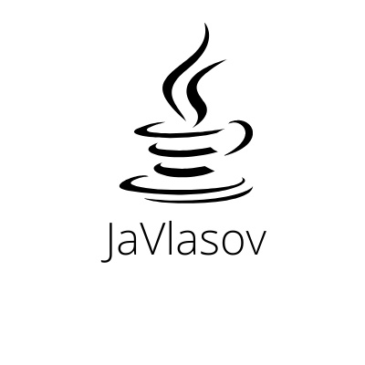

# JaVlasovBlog - блог о программировании и технологиях | blog about programming and technologies.
[English version bellow](./README.md#English version)
___

<h2 align="center">

</h2>

<h2 align="center">

<a  href="https://javlasov-blog.herokuapp.com/">Демоверсия | Live Demo</a></h2>

# Навигация
- [Описание](./README.md#Описание)
- [Локальный запуск](./README.md#Локальный-запуск)
- [База данных](./README.md#База-данных)
- [Покрытие тестами](./README.md#Покрытие тестами)
- [Навигация по проекту](./README.md#Навигация-по-проекту) 
- [Используемые технологии](./README.md#Используемые-технологии)
- [Контанктные данные](./README.md#Контактные-данные)

___
## Описание:
Это дипломный проект образовательной платформы [Skillbox](https://skillbox.ru/), курса **Java-разработчик**.

Данный проект представляет собой обычный блог, который базируется на технологии SpringBoot. (список исп. технологий см. [тут](Линк))

На данном блоге можно:

- Смотреть чужие посты;
- Регистрироваться;
- Редактировать свой профиль;
    - Есть возможность загрузить свою фотографию (она будет автоматически обрезана). Допустимые форматы фотографии jpg\jpeg и png. При попытке загрузить другие форматы вы увидите ошибку. Также можно иметь имя, пароль и email.
- Писать свой пост. Важно: после публикации пост должен утвердить или отклонить модератор сайта;
- Редактировать свои посты;
    - после редактирования на посту автоматически появится галочка "Скрытая публикация". Уберите её, если хотите, чтобы другие пользователи увидели ваш текст.
- Писать комментарии и отвечать на них;
    - также есть возможность помима текста добавить любую фотографию или картинку на ваш выбор (помним про формат файла).
- Ставить оценки публикациям; (лайки или дизлайки)
- Смотреть статистику; (если она открыта)
    - Смотреть статистику можно как свою, так и общую по всему блогу.
- Искать публикации: по слову, по тэгу, по дате публикации;

Несколько медиафайлов для демонстрации:

<h2 align="center">

</h2>

## Как запустить локально:

Для того, чтобы запустить проект локально вам необходимы JDK 11, система контроля версий git, сборщик проектов maven.
Клонировать проект можно через git bash:

    git init
    git clone https://github.com/VlasovM/JaVlasovBlog.git
    
После того, как проект скопировался в ваш локальный репозиторий, вам необходимо изменить несколько значений. Для удобство я поменил их комментарием TODO в коде. Что изменить:
 - [application.properties](https://github.com/VlasovM/JaVlasovBlog/blob/master/src/main/resources/application.properties#L1-L5) -> свойства подключения к базе данных;
    - информацию о базе данных можно прочитать вот [тут](link.com)
 - [PasswordService](https://github.com/VlasovM/JaVlasovBlog/blob/master/src/main/java/com/javlasov/blog/service/PasswordService.java#L122-L136) -> изменить свойства для отправки писем на почту, а также изменить email и пароль; (проверка безопасности от google)
 - [InitService](https://github.com/VlasovM/JaVlasovBlog/blob/master/src/main/java/com/javlasov/blog/service/InitService.java#L21-L25) -> общие данные при инициализации страницы;
 
 Перед инициализацией проекта выполнить
 
    mvn clean install
    
____

## База данных:

В качестве БД используется SQL, в качестве СУБД используется MySQL (локально) и PHPAdministrator (деплой).

Для удобства покажу структуру БД в виде ER-диаграммы:

<h2 align="center">

</h2>

Также дамп базы данных будет доступен по ссылке вот [тут](https://drive.google.com/file/d/1fevEo2pctIz5yZQFCP49EjsDljpog-LP/view?usp=sharing)

В базе данных будут лежать глобальные настройки (таблица global settings), остальные таблицы пустые, создавайте какие вам захочется сущности.
____

## Покрытие тестами:

Тестовые методы прописывались для сервисного слоя (папка service). 

В тестах были использованы такие технологии как JUnit 5 и Mockito.

Процент покрытие тестами были проверены с помощью встроенной утилитой среды разработки (Intelij IDEA) -  Coverage.

Результаты покрытия тестами:

<h2 align="center">

</h2>

<h2 align="center">

</h2>

____
## Навигация по проекту:

[src -> main -> java -> com -> javlasov -> blog:](https://github.com/VlasovM/JaVlasovBlog/tree/master/src/main/java/com/javlasov/blog)

- annotations -> собственные аннотации на валидацию имени, пароля и почты;
- aop ->
    - exceptions -> создание собственных классов ошибок; (наследников Runtime Exception)
    - handlers -> кастомные обработчики тех или иных ошибок;
- api -> 
    - request -> классы-запросы от сервера, содержащие определенные перемееные;
    - response -> классы-ответы для сервера в результате обработки их сервисами;
- config -> настройка конфигурации проекта;
- constants -> постоянное значение формата даты и времени;
- controller -> слой контроллеров;
- dto -> объекты передачи данных; (DTO)
- mappers -> преобразователь POJO -> DTO;
- model ->
    - enums -> классы Enum для Spring Security;
    - entity-классы для таблиц базы данных;
- repository -> слой репозиториев базы данных; (Jpa)
- security -> настройки для авторизации и аутентификации пользователя;
- service -> сервисный слой; (обработка запросов)

Тесты:

[src -> test -> java -> com -> javlasov -> blog -> service](https://github.com/VlasovM/JaVlasovBlog/tree/master/src/test/java/com/javlasov/blog/service)

____

## Используемые технологии:

- Maven;
- Spring;
- Spring boot;
- Spring Security;
- Spring Data;
- Hibernate;
- Junit 5;
- Mockito;
- MapStruct;
- Javax.mail;
- Jsoup;
- Lombok;
- Cage; (captcha)
- commons-io;
- jaxb-api;
- imgscalr-lib;
- assertj-core;

____

## Контактные данные

По всем интересующим вас вопросам можно писать на почту:

m.a.vlasov97@gmail.com

JavlasovM@gmail.com

Или связаться со мной в телеграм:

https://t.me/JaVlasov

____

## English version
